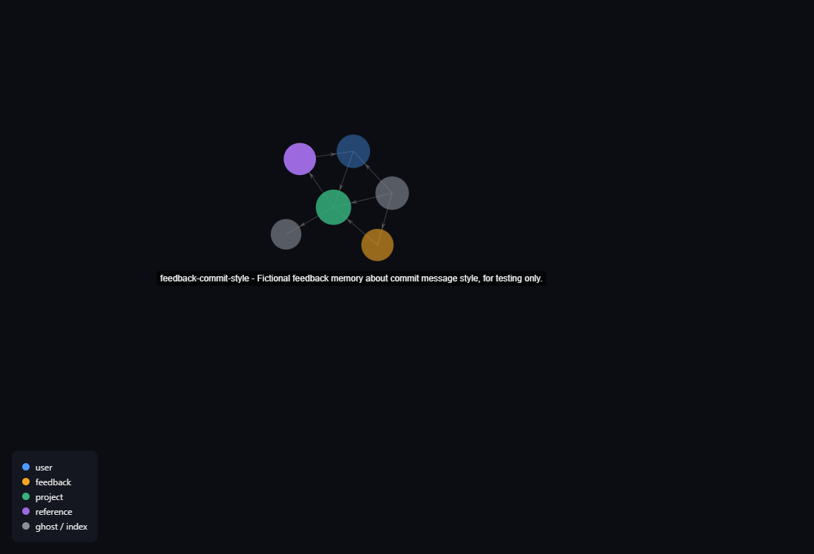

<p align="center">
  
</p>

<h1 align="center">claude-memory-atlas</h1>

<p align="center">
  Render a directory of Claude Code "auto memory" markdown files as one self-contained,
  offline-capable interactive HTML knowledge graph.
</p>

<p align="center">
  <a href="https://github.com/jimmyjames177414/claude-memory-atlas/actions/workflows/ci.yml"></a>
  
  =18">
</p>

<p align="center">
  
  <br>
  <sub><i>Real capture: this tool's own test fixtures (all invented placeholder content), rendered and screenshotted as-is. No server, no build step to view it - just an HTML file.</i></sub>
</p>

No server, no build step for the viewer, no internet connection needed to open it - just
one `.html` file you can email, commit, or drag into a browser tab.

## Input format

`memory-atlas` reads a directory containing:

- Zero or more `*.md` files, each with YAML frontmatter followed by a markdown body:

  ```markdown
  ---
  name: kebab-case-slug
  description: one-line summary
  metadata:
    type: user
  ---
  Free-form markdown body. May contain [[other-slug]] wikilink references to other
  memory files by their `name` value.
  ```

  `metadata.type` is one of: `user`, `feedback`, `project`, `reference`.

- Optionally, a `MEMORY.md` file: a plain markdown index with lines like
  `- [Title](some-file.md) — one-line hook`. It's treated as an index node with an
  edge to every file it links to. Its absence is not an error.

A `[[wikilink]]` that doesn't match any known file's `name` still becomes a node (a
"ghost" node) plus an edge to it, rather than being silently dropped.

## Quick start

```bash
npx github:jimmyjames177414/claude-memory-atlas ~/.claude/projects/*/memory
```

Or clone and install locally:

```bash
git clone https://github.com/jimmyjames177414/claude-memory-atlas.git
cd claude-memory-atlas
npm install
npm run build
node dist/index.js ~/.claude/projects/*/memory
```

### CLI options

```
memory-atlas [path] [--out <file>]
```

| Argument / option | Default | Description |
|---|---|---|
| `path` | `.` | Directory containing memory markdown files |
| `--out <file>` | `./memory-graph.html` | Where to write the generated HTML graph |

If the resolved directory has no `*.md` files, the CLI prints an error to stderr and
exits with status 1. Malformed files (missing the required `name` field) are skipped
with a warning rather than aborting the run.

After writing the HTML file, `memory-atlas` makes a best-effort attempt to open it in
your browser (`wslview`, then `explorer.exe`, then `xdg-open`, then `open`, whichever is
found first - this covers WSL, Linux, and macOS). If none of those succeed, it just
prints the file path for you to open by hand.

## How it works

1. **Parse** - every `*.md` file (except `MEMORY.md`) is parsed with `gray-matter` into
   frontmatter + body.
2. **Extract links** - a regex finds every `[[wikilink]]` in each body.
3. **Build graph** - one node per file; a real edge for each wikilink that resolves to a
   known node, a ghost node + edge for one that doesn't; `MEMORY.md` (if present) becomes
   an index node with edges to the files it links to.
4. **Style** - each `metadata.type` gets a fixed, distinct color; ghost and index nodes
   get a shared neutral color. Node radius scales with how many connections it has, with
   a floor so isolated nodes stay visible. Older nodes fade slightly toward a minimum
   opacity based on file modification time.
5. **Render** - each node's markdown body is converted to HTML at generate-time with
   `marked`. The graph data, the [force-graph](https://github.com/vasturiano/force-graph)
   rendering library, and a small vanilla-JS click handler are all inlined into one HTML
   file - nothing is loaded from a CDN or a server.
6. **Open** - the generated file is opened in your default browser, best-effort.

### A note on trust

Rendered markdown bodies are inserted as HTML (via `marked`) with no sanitization pass.
That's fine for your own memory files - you already trust yourself - but if you point
this at a directory containing files from someone else, a crafted file could run script
in your browser when you open the result. Only run it against memory directories you
trust.

## Development

```bash
npm install
npm run build   # bundle src/ to dist/ with tsup
npm test        # run the vitest suite
```

## License

MIT - see [LICENSE](./LICENSE).

---

<p align="center"><sub>by <a href="https://github.com/jimmyjames177414">@jimmyjames177414</a></sub></p>
